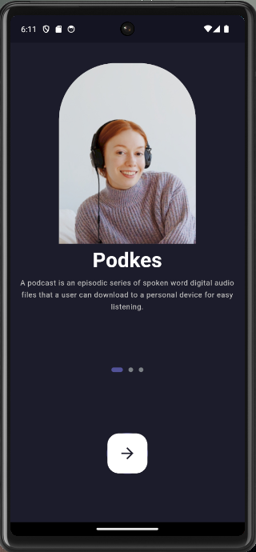
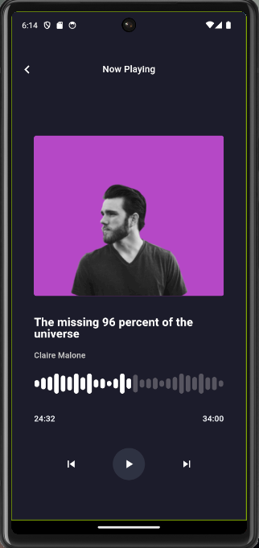
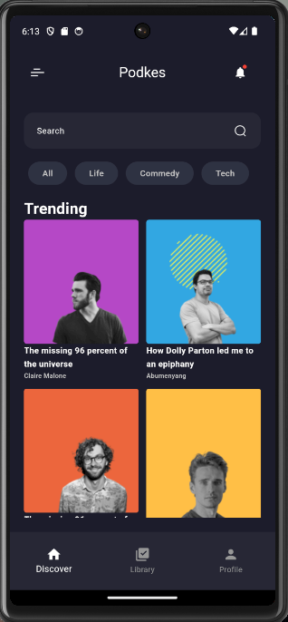

# Getting Starred Explore and Playing Npow

This project, titled "Getting Starred Explore and Playing Npow," is developed as part of my application to Python Company. The project is a Flutter application focusing on user exploration and music playback.

## Project Description

The project is developed using Flutter and provides users with an application centered around exploring and listening to music.

## Features

- Explore Section: Users can discover popular and new music through this section.
- Playlists: Users can create and share their playlists.
- Playback Customizations: Users can customize their music playback experience.

## Screenshots


*Discover popular music on the Explore screen.*


*View playlists created by users.*


*Make customizations during music playback.*

## Installation

1. Clone the project repository to your computer.
   ```bash
   git clone https://github.com/username/project.git
